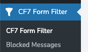
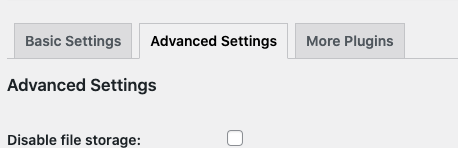
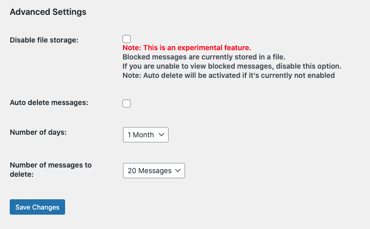

# WordPress Tools

These are a set of helper classes that will make WordPress plugin/theme development easier

## Examples

### 1. Menu page without sub menu page

a. In a class

```php
$menu_title = 'CF7 Form Filter';

$menu_page = new KMMenuPage(
			array(
				'page_title' => 'CF7 Form Filter',
				'menu_title' => $menu_title,
				'capability' => 'read',
				'menu_slug'  => 'kmcf7-message-filter',
				'icon_url'   => 'dashicons-filter',
				'position'   => null,
				'function'   => array(
					$this,
					'dashboard_view'
				)
			) );

$menu_page->run();
```

b. Not in a class

```php
$menu_title = 'CF7 Form Filter';

$menu_page = new KMMenuPage(
			array(
				'page_title' => 'CF7 Form Filter',
				'menu_title' => $menu_title,
				'capability' => 'read',
				'menu_slug'  => 'kmcf7-message-filter',
				'icon_url'   => 'dashicons-filter',
				'position'   => null,
				'function'   => 'dashboard_view'
			) );
$menu_page->run();
```

### 2. Menu page with a sub menu

```php
$menu_title = 'CF7 Form Filter';

$menu_page = new KMMenuPage(
			array(
				'page_title' => 'CF7 Form Filter',
				'menu_title' => $menu_title,
				'capability' => 'read',
				'menu_slug'  => 'kmcf7-message-filter',
				'icon_url'   => 'dashicons-filter',
				'position'   => null,
				'function'   => array(
					$this,
					'dashboard_view'
				)
			) );

$messages_page = new KMSubMenuPage(
			array(
				'parent_slug' => $menu_page->get_menu_slug(),
				'page_title'  => 'Blocked Messages',
				'menu_title'  => 'Blocked Messages',
				'capability'  => 'manage_options',
				'menu_slug'   => 'kmcf7-filtered-messages',
				'position'    => 1
				'function'    => array(
					$this,
					'messages_view'
				)
			) );
$menu_page->add_sub_menu_page( $messages_page );
$menu_page->run();
```

#### output



### 3. Sub Menu page with tabs

```php
	$settings_page = new KMSubMenuPage(
			array(
				'parent_slug' => $menu_page->get_menu_slug(),
				'page_title'  => 'Settings',
				'menu_title'  => 'Settings',
				'capability'  => 'manage_options',
				'menu_slug'   => 'kmcf7-message-filter-options',
				'function'    => array(
					$this,
					'settings_view'
				),
				'use_tabs'    => true
			) );
	$settings_page->add_tab( 'basic', 'Basic Settings', array(
			$this,
			'status_tab_view'
		), array( 'tab' => 'basic' ) );
	$settings_page->add_tab( 'advanced', 'Advanced Settings', array(
			$this,
			'status_tab_view'
		), array( 'tab' => 'advanced' ) );
	$settings_page->add_tab( 'plugins', 'More Plugins', array(
			$this,
			'status_tab_view'
		), array( 'tab' => 'plugins' ) );
	$menu_page->add_sub_menu_page( $settings_page );
```

```php
public function status_tab_view( $args ) {
		switch ( $args['tab'] ) {
			case 'plugins':
				include "views/settings/plugins.php";
				break;
			case 'advanced':
				include "views/settings/advanced.php";
				break;
			default:
				include "views/settings/basic.php";
				break;
		}
	}
```

#### output



### 4. Settings API

```php
$settings = new KMSetting( 'kmcf7-message-filter-options&tab=advanced' );
$settings->add_section( 'kmcfmf_message_filter_advanced' );
$settings->add_field(
			array(
				'type'  => 'checkbox',
				'id'    => 'kmcfmf_message_storage_toggle',
				'label' => 'Disable file storage: ',
				'tip'   => "<span class='text-danger' style='color:red;'>Note: This is an experimental feature.</span><br/>Blocked messages are currently stored in a file. <br/>If you are unable to view blocked messages, disable this option. <br/> <b>Note: </b> Auto delete will be activated if it's currently not enabled"
			)
		);
$settings->add_field(
			array(
				'type'  => 'checkbox',
				'id'    => 'kmcfmf_message_auto_delete_toggle',
				'label' => 'Auto delete messages: ',
				'tip'   => ''
			)
		);
$settings->add_field(
			array(
				'type'  => 'number',
				'id'    => 'kmcfmf_message_auto_delete_duration',
				'label' => 'Number of days: ',
				'tip'   => '',
				'min'   => 1,
				'max'   => ''
			)
		);
$settings->add_field(
			array(
				'type'    => 'select',
				'id'      => 'kmcfmf_message_auto_delete_duration',
				'label'   => 'Number of days: ',
				'options' => array(
					'1 Month' => '30',
					'1 Day'   => '1',
					'3 Days'  => '3',
					'1 Week'  => '7',
					'2 Weeks' => '14',
				),
				// 'default_option' => ''
			)
		);
$settings->add_field(
			array(
				'type'    => 'select',
				'id'      => 'kmcfmf_message_auto_delete_amount',
				'label'   => 'Number of messages to delete: ',
				'options' => array(
					'10 Messages' => '10',
					'20 Messages' => '20',
					'40 Messages' => '40',
					'80 Messages' => '80',
				),
				// 'default_option' => ''
			)
		);
$settings->save();
```

### default field data

```php
$default_data = array(
			'type'           => '',
			'id'             => '',
			'label'          => '',
			'tip'            => '',
			'min'            => '',
			'max'            => '',
			'input_class'    => '', // class for input element
			'class'          => '', // class for parent element
			'options'        => array( 'Select a value' => '' ),
			'default_option' => '',
			'autocomplete'   => 'on',
			'placeholder'    => ''
		);
```

You can display the form using

```php 
$settings->show_form();
```

Alternatively, you don't want to use `show_form()`, you can display the form with your own code

```php
<?php

?>
    <h2>Advanced Settings </h2>
	<?php settings_errors(); ?>
    <form method="post" action="options.php">
		<?php

		settings_fields( 'kmcfmf_message_filter_advanced' );
		do_settings_sections( 'kmcf7-message-filter-options&tab=advanced' );

		submit_button();
		?>
    </form>
<?php
```

### output



## Troubleshooting

### 1. Setting fields not showing on WordPress Dashboard

1. Do not create the setting in the callback function of a menu or submenu, this will not allow the helper to hook into
   the `admin_init` action.

   You can either call the `show_form()` method in the menu page callback function or write the code manually to display
   the form (as shown above) in the callback function
2. If you get `Options page  not found in the allowed options list.` error, set your munu slug as the section
   id [More Info Here](https://wordpress.stackexchange.com/questions/139660/error-options-page-not-found-on-settings-page-submission-for-an-oop-plugin) 